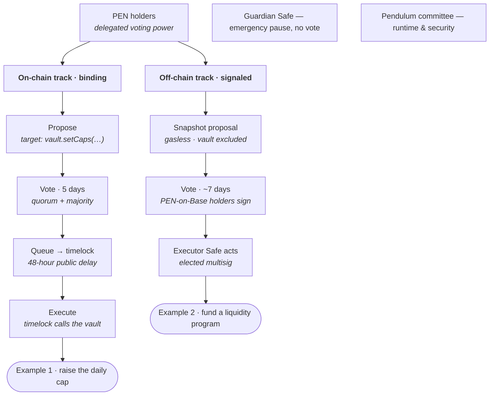

# PEN Governance After the Base Migration — How It Works

| | |
|---|---|
| **Status** | Explainer (companion to the PRD/ADR) |
| **Audience** | PEN holders, contributors, prospective voters |
| **Related** | [PRD §6.7 / G1–G5](pen-base-migration-prd.md), [ADR-001 governance section](adr-001-pen-base-migration-approach.md), `contracts/src/PENGovernor.sol` |

This is a plain-language walkthrough of the hybrid governance model, with two
real-world examples. It describes *how a decision gets made and executed* after
PEN has migrated to Base.

## The three organs

The whole model rests on one idea: **a decision routes to the organ that can
actually execute it.**

- **PEN holders** are the electorate. Voting power is the delegated
  `ERC20Votes` balance of PEN on Base. One practical catch: a holder has **zero
  voting power until they delegate** (to themselves or a representative).
  Holding tokens isn't voting; delegating is.
- **The on-chain track** — `PENGovernor` + a `TimelockController` — handles
  anything that is a deterministic call to a Base contract the timelock
  controls: the `MigrationVault` parameters (caps, attestor set, threshold,
  guardian, remainder sweep) and any Base-side treasury the timelock owns.
  Binding and trustless: nothing but a passed vote can move it.
- **The off-chain track** — Snapshot + an elected executor Safe — handles
  decisions that aren't a single on-chain call: discretionary, multi-step, or
  living off Base (including on the Pendulum parachain). Snapshot signals
  intent gaslessly; the Safe carries it out.

A **guardian Safe** (instant pause, no vote) and the **Pendulum technical
committee** (runtime and security actions on the parachain) sit outside the
token vote — they exist because some actions must be fast, or must run on a
chain the Base Governor can't reach.

The Governor's timing parameters are the deployment defaults and are themselves
governable: voting delay ~1 day, voting period 5 days, timelock delay 48 hours,
quorum a low fraction of supply at launch (raised as circulating supply grows),
plus a proposal threshold of voting power required to open a proposal.

## Example 1 — raising the migration vault's daily cap (on-chain track)

**The situation:** migration is live with deliberately conservative caps.
Volume picks up and legitimate migrations start getting deferred by the rolling
daily cap. The community wants to raise `dailyCap` and `perReleaseCap`. This
belongs on the on-chain track because it is exactly one deterministic action —
a call to `vault.setCaps(...)` — and the timelock is the vault's admin, so no
human needs discretion or custody.

**How it plays out:**

1. A delegate holding at least the proposal threshold of voting power calls
   `propose(...)` with a single action: target `MigrationVault`, calldata
   `setCaps(newPerRelease, newDaily)`, and a human-readable description. The
   proposal appears on Tally in the pending state.
2. After the voting delay (~1 day — this is also when the voting-power snapshot
   is taken, so buying tokens afterward can't influence the vote), voting opens
   for five days. Delegates cast for, against, or abstain. To pass, the
   proposal needs quorum and more for than against.
3. On success, anyone calls `queue(...)`, scheduling the action inside the
   `TimelockController` behind a 48-hour delay. This delay is the safety valve:
   for two days the exact pending change is public, and if it looks wrong the
   guardian can pause the vault while the community reacts.
4. After the 48 hours, anyone calls `execute(...)`. The timelock — as the
   vault's admin — makes the `setCaps` call. The cap is now raised.

Start to finish is roughly **eight days**, and at no point does a trusted party
decide anything. The timelock is the only address that can call `setCaps`, and
it only ever acts on a vote that already passed. Attestor rotation, threshold
changes, and the end-of-window remainder sweep all run through this identical
path.

## Example 2 — funding a liquidity and market-making program (off-chain track)

**The situation:** the DAO wants to bootstrap PEN/USDC liquidity and retain a
market maker for six months, funded with, say, 2,000,000 PEN from the community
treasury. This does not reduce to one on-chain call — it means choosing a
market maker, negotiating terms, moving funds (possibly across venues or
chains), and exercising judgment over six months. That is what the off-chain
track is for.

**How it plays out:**

1. A holder posts the proposal to the forum for discussion, then creates a
   Snapshot proposal. The voting strategy reads PEN balances on Base at a
   snapshot block, with the `MigrationVault` address **excluded** — so the
   large unmigrated balance in the vault can't vote, and quorum is measured
   against circulating supply rather than total supply.
2. Voting runs for roughly a week and is **gasless**: holders sign messages,
   they don't pay gas or even need to delegate. Choices can be a simple
   for/against or several funding options.
3. If it passes, the elected executor Safe carries out the mandate — transfers
   the PEN, contracts the market maker, and manages the engagement over its
   lifetime.

The honest trade-off: Snapshot itself is a *signal*, not an on-chain
instruction, so this track trusts the Safe signers to honor the result. That is
why the signers are elected and why, if you want to harden it, **oSnap** (UMA's
optimistic oracle) can post the Snapshot outcome on-chain so that — if
unchallenged — it becomes directly executable by the Safe, turning "the Safe
should comply" into an economic guarantee rather than a social one.

## The treasury: where the money lives and how it's spent

Example 2 was a treasury spend, so it's worth making the treasury structure
explicit — because the most common wrong assumption is that "the Base treasury"
is a smart contract you build and wire into the others. It isn't.

**A treasury on Base is just an address that holds tokens.** PEN is a plain
ERC-20 — nothing gets registered or connected to it; whoever holds a balance
spends it by calling `transfer`. So you don't author a treasury contract. You
already have the right address: the `TimelockController`. In the OpenZeppelin
Governor pattern the timelock *is* the treasury and the executor at once — it
holds the reserve, and a passed proposal makes it call `transfer`.

The recommended shape is a **split, tiered treasury** that maps straight onto
the three organs:

| Money for… | Lives on | Held / spent by | How |
|---|---|---|---|
| Running the parachain (collators, coretime, Pendulum ops) | Pendulum | `py/trsry`, 3/5 council | existing treasury proposal, pays a Pendulum account in PEN |
| Strategic / large Base spends (reserves, partnerships, big LP) | Base | the `TimelockController` | token-holder proposal → 48h timelock → `transfer` (trustless) |
| Routine Base payouts (grants, MM retainer, small ops) | Base | an elected operating Safe with a delegated budget | Safe multisig tx, optionally Snapshot-signaled (fast) |

The important discipline: **don't route every payout through the full
Governor.** A 48-hour timelocked proposal for a 3,000-PEN contributor grant is
governance theater. Instead, governance grants the operating Safe a periodic
budget in one action ("500k PEN + 200k USDC this quarter"); day-to-day grants
are then Safe transactions inside that mandate, and governance tops it up (or
claws it back) as needed. For recurring payments, fund a stream (Sablier or
Superfluid) so it doesn't need repeated approvals. None of these are bespoke
contracts — the Safe and the streaming tools are standard, audited, and created
through their own apps, not written by us.

### Getting the treasury's PEN to Base

The Pendulum treasury (`py/trsry`) is a keyless account, and the user-facing
`migrate` extrinsic needs a signed origin — so the treasury can't migrate
itself the ordinary way. The `token-migration` pallet therefore has a
governance-gated path, built as two deliberately separate steps:

1. `set_treasury_destination(base_address)` — sets the fixed Base destination
   (the timelock) **once**, as its own reviewed governance action. This is the
   single security anchor: the routine migration call carries no address and so
   cannot be sent to the wrong place by a typo.
2. `migrate_treasury(amount)` — burns `amount` from the treasury account and
   emits the **same** `MigrationInitiated` event as a user migration (with
   `who` = the treasury), so the attestors, vault and monitor handle it
   identically. It always goes to the pre-set destination.

Both are gated by the same authority that already approves treasury spends
(root or 3/5 council), and `migrate_treasury` respects the pallet pause and
keeps the treasury account alive (it can't accidentally reap itself).

Three operational notes when you actually run it:

- **Mind the daily cap.** A large treasury tranche competes with user
  migrations for the vault's rolling daily-cap headroom and may be deferred
  (delayed, never lost — it's marked pending and recoverable). Migrate in
  tranches, or pass a proposal to temporarily raise the cap.
- **Circulating supply doesn't move.** Pendulum-treasury and Base-treasury are
  both non-circulating, so shifting reserves between them changes nothing for
  DefiLlama/CoinGecko — just add the Base treasury address to their excluded
  list alongside the vault.
- **Do it inside the migration window**, coordinated, so the reserve isn't
  stranded if the window later closes.

### The quietly big win

Once the reserve is on Base, the treasury can hold and pay **USDC and other
Base-native assets**, not just PEN — which is what contributors and market
makers usually want to be paid in, and which the Pendulum treasury structurally
cannot do today (it is native-PEN-only). You also gain the option to park
reserves in Base DeFi or provide protocol-owned liquidity. That, more than the
payout mechanics, is the real reason to move the strategic reserve to Base
rather than bridging per payout.

## The routing rule, and three things that trip people up

The whole model collapses to one question: **can the decision be expressed as a
deterministic call to a Base contract the timelock owns?** If yes, it goes
on-chain and executes trustlessly (Example 1). If it needs discretion, multiple
steps, or lives off Base — including anything on the Pendulum parachain, which
the Base Governor cannot reach — it goes to Snapshot and the Safe (Example 2),
or for runtime and security matters, to the Pendulum committee.

Three practical notes that matter in real use:

- **Delegation is a prerequisite for the on-chain track.** A holder with a
  large balance but no delegation has no voting power and can't even meet the
  proposal threshold. This surprises people constantly; launch communications
  should make "delegate to yourself" a first-class step.
- **Emergencies deliberately skip governance.** The guardian Safe can pause the
  vault in one transaction, with no vote, precisely because a 48-hour timelock
  is the wrong tool for an active incident. Governance then decides the actual
  fix through the slow, deliberate path. The guardian is intentionally not the
  Governor.
- **Quorum is tuned for a migration in progress.** Because the vault holds most
  of the supply early on, on-chain quorum is set to a low fraction at launch
  and raised by governance as circulating supply grows, and Snapshot excludes
  the vault outright. Otherwise quorum measured against total supply would be
  unreachable in the early months.
