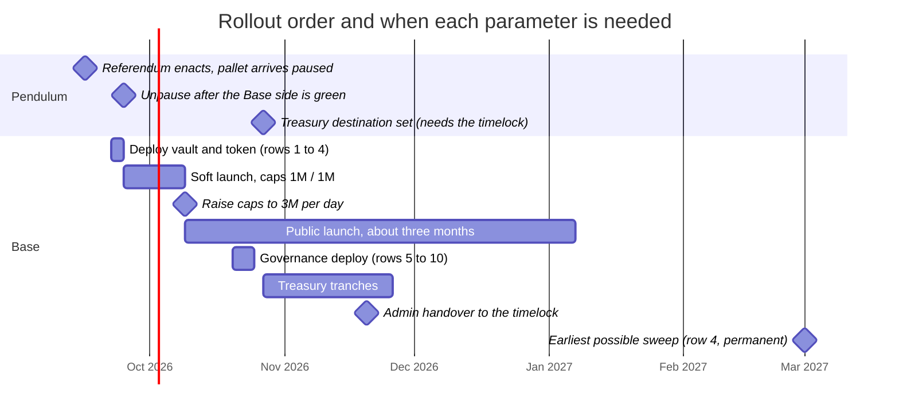
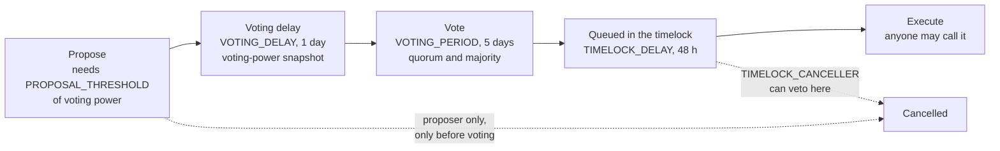
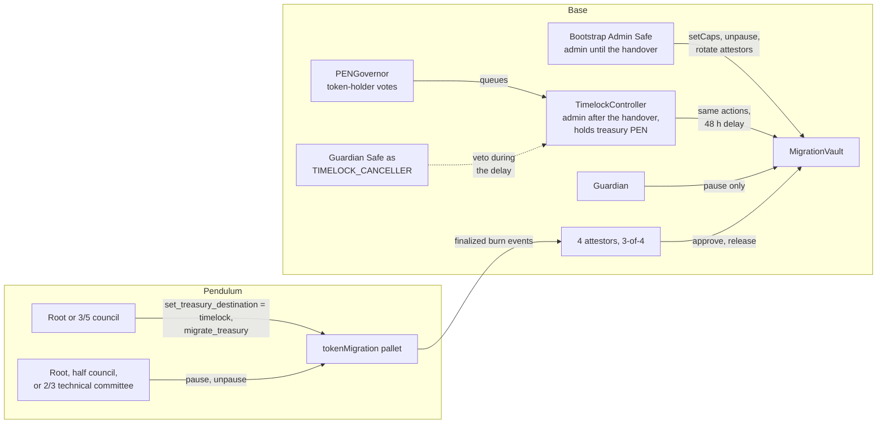

# PEN → Base migration: launch parameters to decide

**Status:** decision brief, 2026-09-15. **Audience:** the migration team.
**Ask:** confirm or change each value below; reply in the thread with objections or "go".

The runtime upgrade is in its referendum. The next step is the Base-side
deployment, and a handful of values have to be fixed before the deploy
script runs. Three of them are permanent or expensive to change, so they
deserve a proper look. For each parameter this brief gives: what it does,
what the code enforces, whether it can still be changed, the trade-off, and
a recommendation grounded in the PRD, the window analysis and the review log.

## 1. Decision summary

| # | Parameter | Can it change later? | Recommendation | What we need from you |
|---|---|---|---|---|
| 1 | Bootstrap Admin Safe (`ADMIN_SAFE`) | Yes, two-step transfer | 3-of-5 Safe, no attestor operators among the signers | Signers and threshold |
| 2 | Per-release cap (`PER_RELEASE_CAP`) | Yes, admin now, 48 h timelock later | 1,000,000 PEN (equal to the daily cap) | Confirm |
| 3 | Daily cap (`DAILY_CAP`) | Yes, admin now, 48 h timelock later | 1,000,000 PEN for the soft launch, then 3,000,000 | Confirm both, and who raises it |
| 4 | Earliest sweep timestamp (`EARLIEST_SWEEP_TS`) | **No, permanent** | 1803859200 = 2027-03-01 00:00 UTC | Confirm, or name a *later* date |
| 5 | Timelock delay | By governance | 172800 s (48 h) | Confirm |
| 6 | Voting delay / period | By governance | 1 day / 5 days | Confirm |
| 7 | Quorum fraction (`QUORUM_FRACTION`) | By governance | 2 % of circulating supply | Confirm |
| 8 | Quorum floor (`QUORUM_FLOOR`) | By governance | About the voting power we expect delegated in week one | Propose a number |
| 9 | Proposal threshold (`PROPOSAL_THRESHOLD`) | By governance | 10,000 to 100,000 PEN | Pick |
| 10 | Timelock canceller (`TIMELOCK_CANCELLER`) | By governance | The Guardian Safe | Confirm |

Rows 1 to 4 are needed for the Base deployment. Rows 5 to 10 belong to the
governance deployment, which can follow later, with one catch explained in
section 4: treasury PEN can only migrate to the governance timelock, so the
governance stack has to exist before the first treasury tranche.

## 2. Where each parameter is needed

Dates are illustrative; the order and the dependencies are the point.

## 3. Base deployment parameters

### 3.1 Bootstrap Admin Safe (`ADMIN_SAFE`)

**What it does.** The Safe on Base mainnet that becomes the vault's admin
right after deployment, by calling `acceptAdmin()`. It holds admin through
the soft launch: raising the caps, unpausing after an incident, rotating an
attestor, and eventually handing admin to the governance timelock.

**Enforced by the code.** Admin transfer is two-step, so a typo in the
address cannot lose control: the deployer proposes, the Safe accepts. Until
the Safe accepts, the deployer key is the live admin, which is why the
acceptance happens in the same sitting as the deploy.

**Rule from the PRD (D4).** While all four attestors are run by us,
separation of duties is the control that carries the security model: the
Safe's signers must not hold attestor keys, and neither may the guardian's.

**Trade-off.** A small threshold means fast reaction during the soft launch;
a large one means slower operations but a harder target. The Safe only holds
admin until the handover, after which the 48 h timelock takes over.

**Recommendation.** 3-of-5, signers spread over at least two teams or
locations, no attestor operators.

### 3.2 Per-release cap (`PER_RELEASE_CAP`)

**What it does.** The largest amount a single migration may release. Above
it the migration is still burned on Pendulum but the release is held until
governance raises the cap; the portal warns before submission and suggests
splitting the amount.

**Enforced by the code.** `perReleaseCap <= dailyCap`. The vault rejects the
inverted pair, because an amount in between would pass the per-release check
yet never fit the daily allowance, and so would be stuck forever.

**Trade-off.** Lower means one bad release is smaller; higher means whales
migrate in one transaction. Since the daily cap already bounds total outflow,
this cap mainly limits the size of a single bad tuple.

**Recommendation.** 1,000,000 PEN, equal to the daily cap, as the checked-in
`.env` example already has it: one knob to reason about, and a whale is
bounded by the daily budget in any case.

### 3.3 Daily cap (`DAILY_CAP`)

**What it does.** A rolling leaky bucket. At most `DAILY_CAP` PEN can be
released in a burst; the budget refills linearly at `DAILY_CAP` per 24 h.
There is no midnight reset.

| Time after a full 1,000,000 PEN burst | Available to release |
|---|---|
| 0 h | 0 |
| 6 h | 250,000 |
| 12 h | 500,000 |
| 24 h | 1,000,000 (full again) |

Over any rolling 24 h the worst case is therefore a full bucket plus a full
refill, up to about twice the cap, spread across the day rather than in one
instant. Size the cap with that in mind.

**Why it matters.** This is the blast-radius bound. If every attestor key were
compromised, this is what could leave the vault before the guardian pauses,
which the monitor does automatically within a poll. The PRD (V4) targets
under 1 to 2 % of the vault per day, that is 1.5 to 3 million PEN.

**The other side: throughput.** Moving about 150 million PEN inside the
three-month target needs an average of about 1.7 million PEN per day (window
analysis). A 1 million per day soft-launch cap is fine for two weeks of team
and invited migrations, but it must be raised promptly once the launch is
verified; 3 million per day, about 2 % of supply, clears the full supply
comfortably inside the window. A release deferred by the cap is delayed,
never lost: the releaser retries it as the bucket refills, and the monitor
pages if a quorum-approved release sits unreleased for too long.

**Recommendation.** 1,000,000 PEN for the soft launch, raised to 3,000,000 by
the Admin Safe once the monitor has been green for the soft-launch period.
Name the person who pulls that trigger.

### 3.4 Earliest sweep timestamp (`EARLIEST_SWEEP_TS`), permanent

**What it does.** Before this time the unmigrated remainder cannot be swept
out of the vault by anyone, governance included. It is a floor, not a
deadline: closing the window is a separate governance decision that can be
deferred indefinitely, and sweeping needs its own timelocked action after
that.

**Enforced by the code.** Immutable in the constructor; a value in the past
is rejected at deployment; a threshold decrease additionally arms a 7-day
settling gate on sweeps.

**The two numbers, on purpose (PRD D5).** The target window we communicate
(about three months) and the floor we guarantee (later) are deliberately
different. The proposed floor, 1803859200 = 2027-03-01 00:00 UTC, is about
six months out; the window analysis chose it and it sits inside the range
the community discussion consulted on.

**Trade-off.** A later floor costs nothing operationally: the remainder
simply waits in the vault, and pausing, communications and shutting down the
attestors are all independent of sweeping. A shorter floor permanently
downgrades the guarantee to holders from "impossible by code" to "possible
via a vote".

**Recommendation.** Confirm 2027-03-01, or choose a later date. Earlier is
the one direction to argue against.

## 4. Governance parameters

These configure the `DeployGovernance` script. They are not needed for the
Base deployment, but note the dependency: treasury PEN migrates to the
governance `TimelockController` and nowhere else (the destination is set once
on Pendulum and can never change), so the governance stack has to be
deployed before the first treasury tranche, even if the vault-admin handover
waits.

### 4.1 How a proposal moves, and where the parameters bite

### 4.2 Timelock delay, voting delay, voting period

Every admin action goes through the timelock after the handover, including
an unpause. The PRD (V5) requires at least 48 h so holders and the monitor
have time to react to a bad proposal. The governance guide's defaults are a
1-day voting delay (which is also the snapshot for voting power) and a 5-day
voting period.

**Recommendation.** 172800 / 86400 / 432000 seconds.

### 4.3 Quorum fraction (`QUORUM_FRACTION`)

**What it does.** The share of voting-eligible supply that must vote For or
Abstain for a proposal to pass. It is measured against **circulating**
supply: the vault's unmigrated balance is parked at a vote sink and can never
vote, and the governor subtracts it from the denominator (PRD G1, review
round 8).

**Why circulating.** With a full-supply denominator, quorum would be
unreachable while most PEN is still in the vault, and an unpause proposal
that can never pass is a permanent freeze.

**Recommendation.** 2 %.

### 4.4 Quorum floor (`QUORUM_FLOOR`)

**What it does.** An absolute minimum quorum in PEN, so proposals are not
trivially cheap while circulating supply is tiny.

| Circulating supply | 2 % quorum | At 0.00858 USD per PEN |
|---|---|---|
| 5 M PEN | 100,000 PEN | about 860 USD |
| 20 M PEN | 400,000 PEN | about 3,400 USD |
| 50 M PEN | 1,000,000 PEN | about 8,600 USD |
| 150 M PEN | 3,000,000 PEN | about 25,700 USD |

**Honest framing (review round 9).** Quorum stake is bought, not burned, and
the prize is the vault, roughly 1.3 million USD at the same price. No floor
prices out capture. Capture resistance comes from the canceller (4.6), the
guardian pause, the release caps and the 48 h delay. The floor's only job is
to stop nuisance proposals on day one, and it must be honestly reachable
soon after launch or governance is dead on arrival, unpause included.

**Recommendation.** Roughly the voting power the team plus a few large
holders will have delegated in the first week. Please propose a number.

### 4.5 Proposal threshold (`PROPOSAL_THRESHOLD`)

**What it does.** Voting power required to open a proposal. A spam guard,
nothing more; it adds no capture resistance.

**Recommendation.** 10,000 to 100,000 PEN.

### 4.6 Timelock canceller (`TIMELOCK_CANCELLER`)

**What it does.** An address granted the right to cancel a queued proposal
during the 48 h delay. The Governor itself can only cancel before voting
starts, and only by the proposer. Without a canceller, nothing can stop a
proposal that has passed, and the delay is not a reaction window at all
(review round 9).

**Recommendation.** The Guardian Safe. Treat this one as required.

### 4.7 The handover itself

Not a parameter, but the decision that makes the values above safe: hand
vault admin to the timelock only once measured, diverse delegated voting
power is comfortably above `max(QUORUM_FLOOR, QUORUM_FRACTION × circulating)`.
Until then the Admin Safe keeps admin. The acceptance proposal itself is the
first proof that quorum works.

## 5. Who controls what

## 6. Sources

- `docs/pen-base-migration-prd.md`: D4 attestor set, D5 window policy, V4 caps, V5 timelock, G1 quorum on circulating supply.
- `docs/pen-migration-window-analysis.md`: the 1.7 M PEN per day arithmetic and the 2027-03-01 floor.
- `docs/pen-governance-guide.md`: proposal lifecycle and the treasury destination (the timelock).
- `docs/pen-migration-internal-review.md`: rounds 8 and 9 on the quorum denominator, the floor, and the canceller.
- `contracts/.env.example`: the checked-in defaults for the Base deployment.
